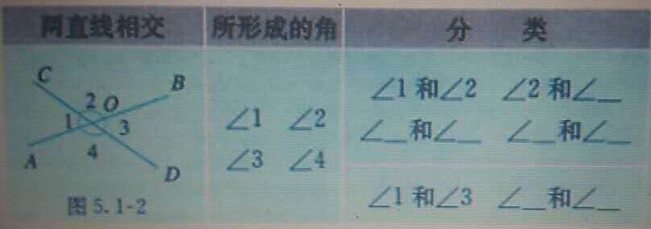

### Week Eight 7年级下
#### 相交线

* 邻补角：角1和角2有一条公共边OC，它们的另一边互为反向延长线（角1与角2互补），具有这种关系的两个角，互为邻补角（adjacent angles on a straight line）
* 对顶角：角1和角3有一个公共顶点O，并且角1的两边分别为角3的两边的反向延长线，具有这种位置关系的两个角，互为顶角（vertical angles）
* 对顶角相等
* 垂直（perpendicular）:垂直是相交的一种特殊情形，两条直线互相垂直。其中一条直线叫做另一条直线的垂线（perpendicular line）
*                      它们的焦点叫做垂足（foot of a perpendicular）
* 过一点有且只有一条直线与已知直线垂直
* 链接直线外一点与直线上各点的所有线段中，垂线段最短。垂线段的长度叫做点到直线的距离。
#### 平行线
* 在一个平面上，两条不相交直线互相平行（parallel），记作：a//b
* 经过直线外一点，有且只有一条直线与这条直线平行
* 如果两条直线都与第三条直线平行，那么这两条直线也互相平行
##### 直线平行的条件
* 方法1：两条直线被第三条直线所截，如果同位角相等，那么这两条直线平行
* 方法2：两条直线被第三条直线所截，如果内错角相等，那么这两条直线平行
* 方法3：两条直线被第三条直线所截，如果同旁内角互补，那么这两条直线平行
##### 平行线的性质
* 两直线平行，同位角相等
* 两直线平行，内错角相等
* 两直线平行，同旁内角互补
##### 两条平行线的距离
* 同时垂直于两条平行线，并且夹在这两条平行线间的线段的长度，叫做两条平行线的距离
##### 命题（proposition）
* 许多命题都由题设和结论两部分组成，题设是已知事项，结论是由已知事项推出的结论

