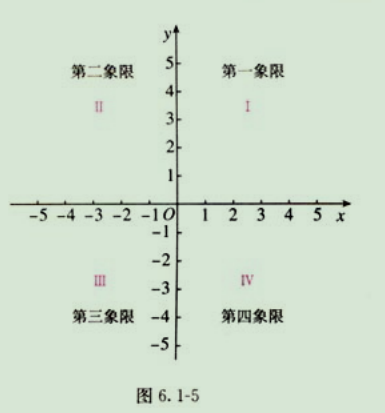

### Week9-7年级下
#### 平面直角坐标系
##### 有序素对：把有顺序的两个数a和b组成的数对，叫做有序数对（ordered pair）
##### 平面直角坐标系
* 在一条数轴上的点可以用一个数来表示，这个数叫做这个点的坐标。知道数轴上一个点的坐标，也就确定了这个点在数轴上的位置。
* 平面内画两条互相垂直、原点重合的数轴，组成平面直角坐标系（rectangular coordinate system）.水平数轴成为x轴（x-axis）或横轴，竖直的数轴为y轴（y-axis）或纵轴；两个坐标轴的交点为平面直角坐标系的原点。
* 坐标（x,y）

两条坐标轴将坐标平面分成四个象限

### 第7章 三角形
* 三角形（triangle）
* 三角形内角之和等于180度
* 三角形两边之和大于第三边
* 高（altitude）：顶点到底边的线段的距离
* 中线（median）：垂线段
* 角平分线（bisector of angle）
* 三角形具有稳定性
#### 三角形的外角
* 三角形的一个外角等于与它不相邻的两个内角的和
* 三角形的一个外角大于与它不相邻的任何一个内角

#### 多边形（polygon）

