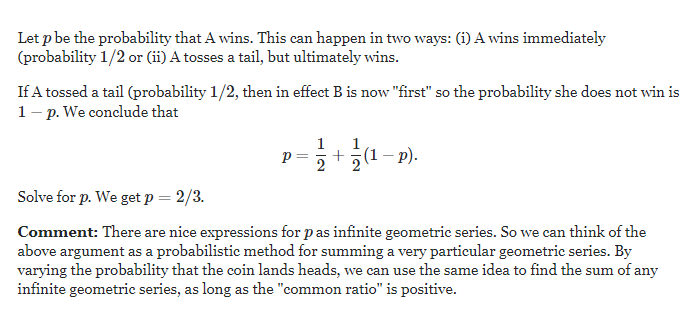

## Two players alternately flip a coin; what is the probability of winning by getting a head?
Two players, A and B, alternately and independently flip a coin and the first player to get a head wins. 
Assume player A flips first. If the coin is fair, what is the probability that A wins?

